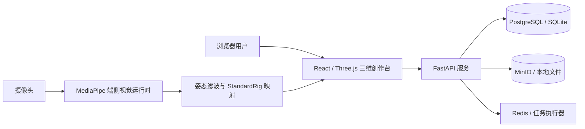

# 自主可控模块化数字人平台

> 面向数字内容创作与互动展示的一站式 Web 3D 数字人平台｜中国国际大学生创新大赛 V1 参赛交付版

平台打通了“创建人物—导入模型—个性换装—动作驱动—资产管理”的完整链路。用户既可以通过参数化编辑快速创建数字人，也可以导入自有 VRM/GLB 模型；摄像头画面由浏览器端 MediaPipe 实时解析，原始视频和人体关键点无需上传服务器。

## 核心能力

| 模块 | 能力 |
| --- | --- |
| 参数化捏人 | 11 个脸型参数、4 个体型参数、肤色与眼睛色板，支持实时预览、撤销/重做和乐观锁保存 |
| 模块化换装 | 16 件内置发型、上装、下装、鞋与配件；支持槽位冲突检测、体型范围校验和 BodyMask 防穿透 |
| 外部模型导入 | VRM/GLB 上传后自动检查骨架、蒙皮、性能和权属，输出 `FULL`、`POSE_ONLY` 或 `REJECTED` 分级报告 |
| 实时动作驱动 | 内置待机、挥手、走路动作；支持摄像头校准、姿态滤波、骨骼映射、跟踪丢失平滑回退和实验性手部追踪 |
| 人物与资产管理 | 人物档案、封面、复制、删除，以及管理员侧资产发布、下架和 Manifest 校验任务 |
| 隐私与离线能力 | 视觉推理在浏览器本地完成；模型与 WASM 可本地化部署，适合比赛现场和离线环境 |

## 系统架构



| 层级 | 技术 |
| --- | --- |
| Web 前端 | React 18、TypeScript、Vite、Three.js、`@pixiv/three-vrm`、Zustand |
| 视觉与骨骼 | MediaPipe Tasks Vision、One Euro Filter、StandardRig |
| API 服务 | FastAPI、SQLAlchemy、Pydantic、JWT |
| 生产基础设施 | Nginx、PostgreSQL、Redis、MinIO、Docker Compose |

## 快速开始

环境要求：Node.js 20+、Python 3.11。首次运行需要联网下载依赖和 MediaPipe 模型。

### 一键启动（macOS）

```bash
git clone https://github.com/lamp-cat/digital-human-platform.git
cd digital-human-platform
bash scripts/start.sh
```

脚本会安装依赖、准备端侧视觉模型并启动：

- Web 平台：<http://localhost:5173>
- API 文档：<http://localhost:8000/docs>

### 分步启动

```bash
# 安装前端依赖并本地化 MediaPipe 模型/WASM
npm install
bash scripts/setup-mediapipe.sh

# 终端 1：启动后端（自动创建 venv、安装依赖和生成种子数据）
bash scripts/dev-api.sh

# 终端 2：启动前端
bash scripts/dev-web.sh
```

本地演示账号：

| 账号 | 密码 | 角色 |
| --- | --- | --- |
| `demo@dhp.local` | `demo123456` | 普通用户 |
| `admin@dhp.local` | `admin123456` | 系统管理员 |

> 以上账号仅用于本地演示。生产环境请更换种子账号并设置高强度 `JWT_SECRET`。

开发模式默认使用 SQLite、本地文件存储和进程内任务执行器；完整配置见 [`.env.example`](.env.example)。

## 项目结构

```text
apps/
├── web/                 React + Three.js 三维创作台
└── api/                 FastAPI 鉴权、人物、资产、导入与任务服务
packages/
├── avatar-schema/       AvatarProfile、StandardRig、Manifest 与错误码
├── avatar-runtime/      底模、换装事务、BodyMask、动画与导入模型加载
├── rig-mapping/         校准、滤波、关键点到骨骼旋转映射与丢失回退
└── vision-runtime/      浏览器端姿态、手部和视频文件追踪
infra/                   Nginx 与 Docker Compose 生产部署
docs/                    API 契约及第三方组件说明
scripts/                 启停、资源准备与动作驱动验证脚本
```

## 测试与构建

```bash
# TypeScript 单元测试
npm run test

# 类型检查和生产构建
npm run typecheck
npm run build

# Python API 测试
cd apps/api
source .venv/bin/activate
pytest
```

## Docker 部署

```bash
cd infra/docker
JWT_SECRET='<替换为随机高强度密钥>' docker compose up --build
```

启动后通过 <http://localhost> 访问平台。生产拓扑为 Nginx → Web/API → PostgreSQL、Redis 与 MinIO。

## 设计亮点

- **统一人物规范**：以 `AvatarProfile`、`StandardRig` 和 Manifest 作为跨前后端契约，隔离模型来源差异。
- **事务式换装**：校验、预构建和提交作为一个完整事务；失败时保留原穿搭和人物状态。
- **导入能力分级**：不把“文件可解析”等同于“平台完全兼容”，用结构化报告明确可编辑与可驱动边界。
- **隐私优先的动作识别**：视频帧和关键点留在用户设备，服务端只处理人物和资产业务。
- **可恢复降级**：摄像头不可用、跟踪丢失或导入服务异常时，平台均提供清晰回退路径。

## V1 边界

- 内置底模与衣物为程序化生成的演示资产，接口和换装规范已按可替换资产设计。
- 导入人物的通用换装采用近似适配，衣物按内置 1.70 m 底模构建。
- 摄像头驱动以单人躯干与四肢大骨架为主；手部追踪为实验性功能。
- AI 照片建模、RGB-D 扫描和布料物理模拟属于后续版本规划。

## 更多文档

- [Web 前端与页面说明](apps/web/README.md)
- [API 契约](docs/api/api-contract.md)
- [第三方组件与许可证](docs/third-party/THIRD_PARTY_NOTICES.md)

本仓库尚未声明项目源代码许可证；第三方组件与示例资产分别遵循其原始许可条款。
